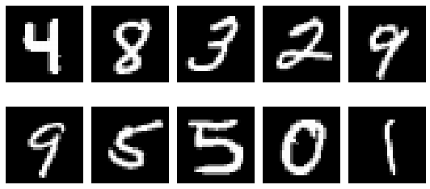
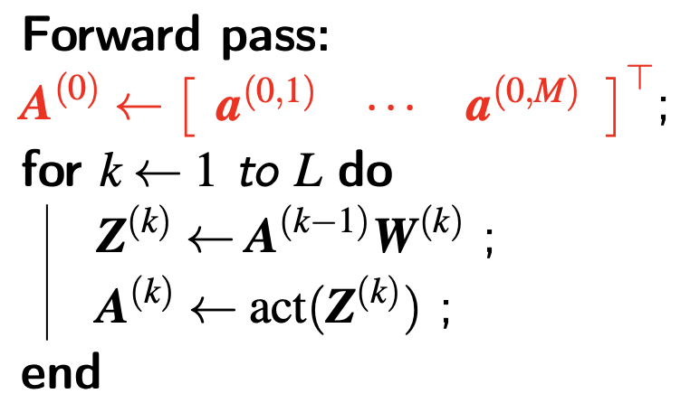
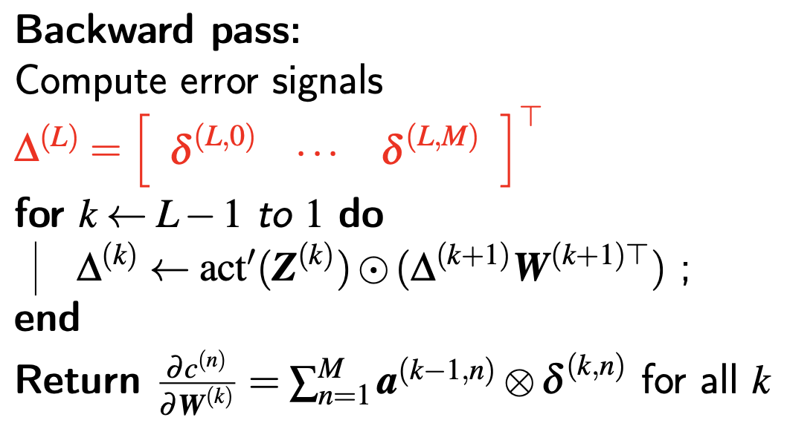

# Neural Networks from Scratch
In this tutorial, you will learn the fundamentals of how you can build neural networks without the help of the deep learning frameworks, and instead by using NumPy.

<p align="center">
	
</p>

*This article was first published by [CS565600 Deep Learning](https://nthu-datalab.github.io/ml/index.html) at National Tsing Hua University, but authored by Chia-Hung Yuan and DataLab.*

Creating complex neural networks with different architectures in Python should be a standard practice for any Machine Learning Engineer and Data Scientist. But a genuine understanding of how a neural network works is equally as valuable. This is what we aim to expand on in this article, the very fundamentals on how we can build neural networks, without the help of the frameworks that make it easy for us.

## Usage
You can train the model by executing the following command:
```bash
python train.py
```
It takes about 10s on CPU to achieve ~98% test accuracy on MNIST dataset.

You can also choose the activation function and optimizer to use. We have implemented ReLU and sigmoid activation functions. Momentum and SGD are available as an optimizer. For example,

```bash
python train.py --activation sigmoid --optimizer momentum --l_rate 4
```
- `--activation`: `relu` or `sigmoid`
- `--optimizer`: `sgd` or `momentum`
- `--batch_size`: batch sized used for training
- `--l_rate`: learning rate
- `--beta`: beta in momentum optimizer

For Jupyter notebook, please refer to [`NN-from-Scratch.ipynb`](https://github.com/lionelmessi6410/Neural-Networks-from-Scratch/blob/main/NN-from-Scratch.ipynb).

# Tutorial
## Model architecture
We are building a basic deep neural network with **3 layers** in total: **1 input layer**, **1 hidden layers** and **1 output layer**. All layers will be fully connected. We implement ReLU and sigmoid activation functions. SGD and Momentum optimizer are available.

Let's try to define the layers in an exact way. To be able to classify digits, we must end up with the probabilities of an image belonging to a certain class, after running the neural network, because then we can quantify how well our neural network performed.

1. Input layer: In this layer, we input our dataset, consisting of 28x28 images. We flatten these images into one array with 28×28=784 elements. This means our input layer will have 784 nodes.
2. Hidden layer: In this layer, we have decided to reduce the number of nodes from 784 in the input layer to 64 nodes.
3. Output layer: In this layer, we are reducing the 64 nodes to a total of 10 nodes, so that we can evaluate the nodes against the label. This label is received in the form of an array with 10 elements, where one of the elements is 1, while the rest is 0.

## Dataset preparation
In this tutorial, we will use [MNIST dataset](http://yann.lecun.com/exdb/mnist/) to demo how to build a neural network. MNIST contains 70,000 images of hand-written digits, 60,000 for training while 10,000 for testing, each 28×28 pixels, in greyscale with pixel-values from 0 to 255.

<p align="center">
	
</p>

## Initialization
The specific problem that arises, when trying to implement the feedforward neural network, is that we are trying to transform from 784 nodes all the way down to 10 nodes. When instantiating the `DeepNeuralNetwork` class, we pass in an array of sizes that defines the number of activations for each layer.

```python
dnn = DeepNeuralNetwork(sizes=[784, 64, 10])
```

This initializes the `DeepNeuralNetwork` class by the init function.

```python
def __init__(self, sizes, activation='sigmoid'):
    self.sizes = sizes
    
    # Choose activation function
    if activation == 'relu':
        self.activation = self.relu
    elif activation == 'sigmoid':
        self.activation = self.sigmoid
    
    # Save all weights
    self.params = self.initialize()
    # Save all intermediate values, i.e. activations
    self.cache = {}
```

To smarten up our initialization, we shrink the variance of the weights in each layer. Following [this nice video](https://www.coursera.org/lecture/deep-neural-network/weight-initialization-for-deep-networks-RwqYe) by Andrew Ng, we’ll set the variance for each layer to 1/n, where n is the number of inputs feeding into that layer. We use `np.random.randn()` function to get our initial weights, which draws from the standard normal distribution. So to adjust the variance to 1/n, we just divide by √n. 

The initialization of weights in the neural network is kind of hard to think about. To really understand how and why the following approach works, you need a grasp of linear algebra, specifically dimensionality when using the dot product operation, which is beyond the scope of this class.

```python
def initialization(self):
    # Number of nodes in each layer
    input_layer=self.sizes[0]
    hidden_1=self.sizes[1]
    hidden_2=self.sizes[2]
    output_layer=self.sizes[3]

    params = {
        'W1':np.random.randn(hidden_1, input_layer) * np.sqrt(1./hidden_1),
        'W2':np.random.randn(hidden_2, hidden_1) * np.sqrt(1./hidden_2),
        'W3':np.random.randn(output_layer, hidden_2) * np.sqrt(1./output_layer)
    }

    return params
```

## Feedforward
The forward pass consists of the dot operation in NumPy, which turns out to be just matrix multiplication. As described in the [introduction to neural networks](https://mlfromscratch.com/neural-networks-explained/#/) article, we have to multiply the weights by the activations of the previous layer. Then we have to apply the activation function to the outcome. 

To get through each layer, we sequentially apply the dot operation, followed by the sigmoid/relu activation function. In the last layer we use the softmax activation function, since we wish to have probabilities of each class, so that we can measure how well our current forward pass performs.



```python
def feed_forward(self, x):
    self.cache["X"] = x
    self.cache["Z1"] = np.matmul(self.params["W1"], self.cache["X"].T) + self.params["b1"]
    self.cache["A1"] = self.activation(self.cache["Z1"])
    self.cache["Z2"] = np.matmul(self.params["W2"], self.cache["A1"]) + self.params["b2"]
    self.cache["A2"] = self.softmax(self.cache["Z2"])
    return self.cache["A2"]
```

The following are the activation functions used for this article. As you can see, we provide a derivative version of the relu and sigmoid, since we will need that later on when backpropagating through the neural network.

```python
def relu(self, x, derivative=False):
    if derivative:
        x = np.where(x < 0, 0, x)
        x = np.where(x >= 0, 1, x)
        return x
    return np.maximum(0, x)

def sigmoid(self, x, derivative=False):
    if derivative:
        return (np.exp(-x))/((np.exp(-x)+1)**2)
    return 1/(1 + np.exp(-x))

def softmax(self, x):
    # Numerically stable with large exponentials
    exps = np.exp(x - x.max())
    return exps / np.sum(exps, axis=0)
```

Note: A numerical stable version of the softmax function was chosen, you can read more from [Stanford CS231n](https://cs231n.github.io/linear-classify/#softmax) course.

## Backpropagation
The backward pass is hard to get right, because there are so many sizes and operations that have to align, for all the operations to be successful. Here is the full function for the backward pass; we will go through each weight update below.



For people who are interested in the magic of backpropagation, please refer to [this nice article](https://mlfromscratch.com/neural-networks-explained/). For people who want to deep dive into methmetics and understand thoroughly, please refer to [NTHU CS565600 Deep Learning](https://nthu-datalab.github.io/ml/index.html). Here is [slide](https://nthu-datalab.github.io/ml/slides/10_NN_Design.pdf) and [video](https://www.youtube.com/watch?v=uYRUbvyKXAo&list=PLlPcwHqLqJDk3A0qFgFUDlyALzaF44NTL&index=4&ab_channel=Shan-HungWu) for backpropagation.

```python
def back_propagate(self, y, output):
    current_batch_size = y.shape[0]

    dZ2 = output - y.T
    dW2 = (1./current_batch_size) * np.matmul(dZ2, self.cache["A1"].T)
    db2 = (1./current_batch_size) * np.sum(dZ2, axis=1, keepdims=True)

    dA1 = np.matmul(self.params["W2"].T, dZ2)
    dZ1 = dA1 * self.activation(self.cache["Z1"], derivative=True)
    dW1 = (1./current_batch_size) * np.matmul(dZ1, self.cache["X"])
    db1 = (1./current_batch_size) * np.sum(dZ1, axis=1, keepdims=True)

    self.grads = {"W1": dW1, "b1": db1, "W2": dW2, "b2": db2}
    return self.grads
```

## Training (Stochastic Gradient Descent)
We have defined a forward and backward pass, but how can we start using them? We have to make a training loop and choose to use Stochastic Gradient Descent (SGD) as the optimizer to update the parameters of the neural network.

There are two main loops in the training function. One loop for the number of epochs, which is the number of times we run through the whole dataset, and a second loop for running through each batch one by one.

For each batch, we do a forward pass by calling `self.feedforward()` with `x`, which is one batch in an array with the length 784, as explained earlier. The `output` of the forward pass is used along with `y`, which are the one-hot encoded labels (the ground truth), in the backward pass. `self.back_propagate()` returns the gradients of weights.

```python
def train(self, x_train, y_train, x_test, y_test):
    for i in range(self.epochs):
        # Shuffle
        permutation = np.random.permutation(x_train.shape[0])
        x_train_shuffled = x_train[permutation]
        y_train_shuffled = y_train[permutation]

        for j in range(num_batches):
            # Batch
            begin = j * self.batch_size
            end = min(begin + self.batch_size, x_train.shape[0]-1)
            x = x_train_shuffled[begin:end]
            y = y_train_shuffled[begin:end]

            # Forward
            output = self.feed_forward(x)
            # Backprop
            grad = self.back_propagate(y, output)
            # Optimize
            self.optimize(l_rate=l_rate, beta=beta)
```

The `optimize()` function has the code for both SGD and momentum update rules. SGD algorithm is relatively straightforward, updating the networks by calculated gradient directly, while momentum make the same movement in the last iteration, corrected by negative gradient.

```python
def optimize(self, l_rate=0.1, beta=.9):
    '''
        Stochatic Gradient Descent (SGD):
        θ^(t+1) <- θ^t - η∇L(y, ŷ)

        Momentum:
        v^(t+1) <- βv^t + (1-β)∇L(y, ŷ)^t
        θ^(t+1) <- θ^t - ηv^(t+1)
    '''
    if self.optimizer == "sgd":
        for key in self.params:
            self.params[key] = self.params[key] - l_rate*self.grads[key]
    elif self.optimizer == "momentum":
        for key in self.params:
            self.momemtum_opt[key] = (beta*self.momemtum_opt[key] + (1.-beta)*self.grads[key])
            self.params[key] = self.params[key] - l_rate * self.momemtum_opt[key]

```

After having updated the parameters of the neural network, we can measure the accuracy on a validation set that we conveniently prepared earlier, to validate how well our network performs after each iteration over the whole dataset.

```python
def accuracy(self, y, output):
    return np.mean(np.argmax(y, axis=-1) == np.argmax(output.T, axis=-1))
```

Finally, we can call the training function, after knowing what will happen. We use the training and validation data as input to the training function, and then we wait.

```python
dnn.train(x_train, y_train, x_val, y_val)
```

## Good exercises in NumPy
You might have noticed that the code is very readable, but takes up a lot of space and could be optimized to run in loops. Here is a chance to optimize and improve the code. For example, you can optimize the forward and backward pass, such that they run in a for loop in each function. This makes the code easier to modify and possibly easier to maintain. 

More challenging exercises including implement any other activation function from this overview of activation functions, and remember to implement the derivatives as well. Different optimizers, e.g. Adam, RMSProp, etc, are also worth to try.

## Reference 
1. [CS565600 Deep Learning](https://nthu-datalab.github.io/ml/index.html), National Tsing Hua University
2. [Building a Neural Network from Scratch: Part 1](https://jonathanweisberg.org/post/A%20Neural%20Network%20from%20Scratch%20-%20Part%201/)
3. [Building a Neural Network from Scratch: Part 2](https://jonathanweisberg.org/post/A%20Neural%20Network%20from%20Scratch%20-%20Part%202/)
4. [Neural networks from scratch](https://developer.ibm.com/technologies/artificial-intelligence/articles/neural-networks-from-scratch), IBM Developer
5. [The Softmax Function Derivative (Part 1)](https://aimatters.wordpress.com/2019/06/17/the-softmax-function-derivative/)